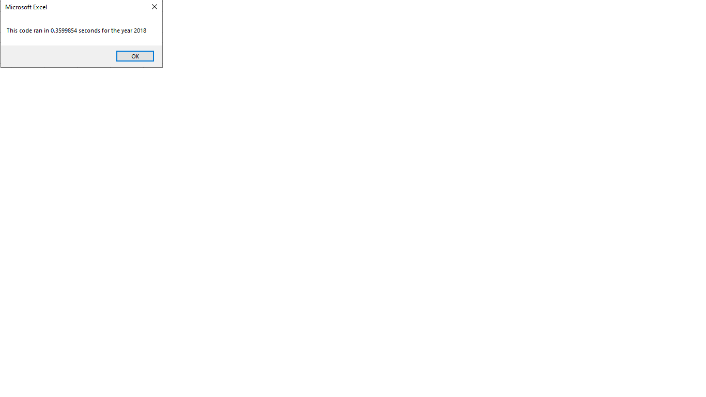

# Stock-Analysis with VBA and Excel
## Overview: VBA Stock Analysis Project

We are analyzing the yearly stock data to compare the stock performance between 2017 and 2018, as well as the execution times 
of the original script and the refactored script.

## Purpose

Purpose of this project was to refactor the VBA code to determine the stocks information of year 2017 and 2018 is worth or not to invest in them.
 
We must analyze the data with the help of Excel and VBA code.

Normally we analyze the data with the help of Excel but sometimes that could be time consuming.

So here we used VBA to analyze the given stock data by writing a subroutine "ALL Stocks Analysis" and " All Stocks Analysis Refactored".

1. Original Script "All stocks Analysis"
2. Refactored script 

**Analysis and Challenges**

**1. Original Script "All stocks Analysis"**

	
- In "All Stocks Analysis" with the help of given process and examples(Using array, loops,timer,formmating data).
- We find out the stocks information according to year"2017" and"2018".
- With the help of setting timer,it shows how much time it required to run the process or code.
- Refer the below screen shot.

	

	
		
	

**2. Refactored script "All Stocks Analysis Refactored"**

 
	
- In "All Stocks Analysis Refactored", Goal was to refactor the code to increase the efficiency of the original code.
- With the help of setting timer, it shows how much time it required to run the process or code.
- Refer the below screen shot
	

## Data Background

Given data was about 12 different stocks. It is having information about stocks including
ticker value, date issued, opening, closing and adjusted closing price with highest and lowest price and their volumes.

## Analysis

With the help of given steps, I began to copy required data and write the code as per the requirements mentioned in the challenge.
- Input box
- Chart headers
- Ticker array,
- Activate the worksheet
- Timer

Below given code, which I was trying to refactor the data and images to understand how refactoring increases the efficiency of the code.

	
	'1a) Create a ticker Index
	
	tickerIndex = 0

	'1b) Create three output arrays

	Dim tickerVolumes(12) As Long
	
	Dim tickerStartingPrices(12) As Single
	
	Dim tickerEndingPrices(12) As Single

	'2a) Create a for loop to initialize the tickerVolumes to zero.
	' Increase the tickerIndex if next rows ticker dosent match

	For i = 0 To 11
	
	tickerVolumes(i) = 0
	
	tickerStartingPrices(i) = 0
	
	tickerEndingPrices(i) = 0
	
	Next i

	'2b) Loop over all the rows in the spreadsheet.

	For i = 2 To RowCount

	'3a) Increase volume for current ticker

	 tickerVolumes(tickerIndex) = tickerVolumes(tickerIndex) + Cells(i, 8).Value
 
	'3b) Check if the current row is the first row with the selected tickerIndex.
	'If  Then

	If Cells(i, 1).Value = tickers(tickerIndex) And Cells(i - 1, 1).Value <> tickers(tickerIndex) Then

	tickerStartingPrices(tickerIndex) = Cells(i, 6).Value

	End If

	'3c) Check if the current row is the last row with the selected ticker

	'If  Then

	If Cells(i, 1).Value = tickers(tickerIndex) And Cells(i + 1, 1).Value <> tickers(tickerIndex) Then
	
	tickerEndingPrices(tickerIndex) = Cells(i, 6).Value
	End If

	'3d) Increase the tickerIndex.

	If Cells(i, 1).Value = tickers(tickerIndex) And Cells(i + 1, 1).Value <> tickers(tickerIndex) Then
	tickerIndex = tickerIndex + 1

	End If

**Summary:**

What are the advantages or disadvantages of refactoring code?

You need to write the code which has small changes and efficiency that would make your code better and in working mode.

**1. Advantages-**

	    -With the help of VBA interpretation (Excel) of code, you can find out the patterns which are not easy to see through source.
	    -Errors can easily appear in well-structured code that contains loops.

	

	

**2. Disadvantages-**

	    -It is time consuming.
	    -You must change the logic to eliminate the duplicate lines.
	    -It can also affect the testing outcomes.
	

 
   

**How do these pros and cons apply to refactoring the original VBA script?**
	

It is the easy way to rearrange, restructure, and clarify existing code at the same time even not changing the behavior of your code.
	

- It also produces a good code base, making it useable, readable for you or any other who is going to develope it or use it..

- A clean and well-organized code is always easy to change, easy to understand, and easy to maintain.

- You can avoid facing difficulty later if you pay attention to the code refactoring process earlier.
	

